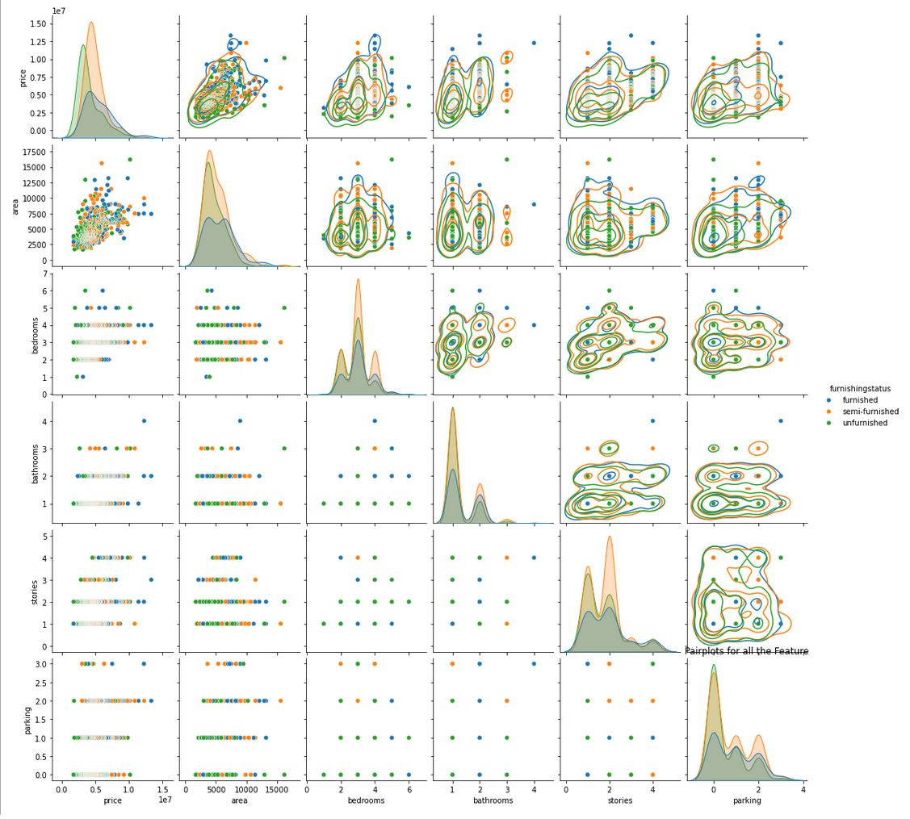
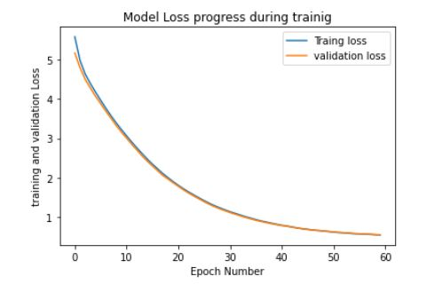

# Housing_Price
A simple Neural Network Model to predict housing prices based on house features such as the number of bedrooms, total area, and other relevant characteristics. We are using the Kaggle Housing Prices Dataset. The dataset exhibits multicollinearity, a situation where predictor variables are highly correlated with each other. To address this multicollinearity problem and improve model performance, we employ Principal Component Analysis (PCA) for dimensionality reduction.



```
Mean Absolute Error (MAE): 0.46
Mean Squared Error (MSE): 0.38
Root Mean Squared Error (RMSE): 0.62
R-squared (R^2): 0.67

```

